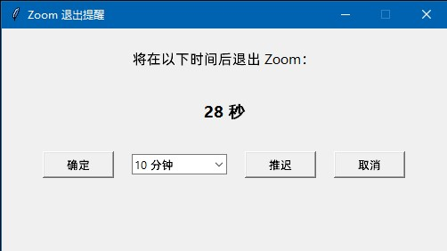

# Zoom 退出提醒工具

## 简介
本工具是一个基于 Python 和 Tkinter 的桌面应用程序，用于Windows系统在指定时间后自动退出 Zoom 应用程序。用户可以通过界面设置倒计时或推迟退出时间，方便管理 Zoom 的使用。

## 功能
1. **自动退出 Zoom**：程序会在倒计时结束后自动关闭 Zoom。
2. **倒计时显示**：实时显示剩余时间，支持“分钟:秒”的格式。
3. **推迟退出**：用户可以选择推迟退出时间（10 分钟、30 分钟或1小时）。
4. **取消退出**：用户可以随时取消退出操作。

## 使用方法
1. **运行程序**：
   - Windows系统
   - 确保已安装 Python 环境（推荐 Python 3.6 及以上版本）。
   - 双击运行 `quit-zoom.py` 文件，或在终端中运行以下命令：
     ```bash
     python quit-zoom.py
     ```

2. **界面操作**：
   - 程序启动后，会显示一个倒计时窗口，提示将在指定时间后退出 Zoom。
   - 用户可以选择以下操作：
     - **确定**：立即退出 Zoom 并关闭程序。
     - **推迟**：选择推迟时间（10 分钟、30 分钟或1小时），然后点击“推迟”按钮，倒计时将重置为新的时间。
     - **取消**：取消退出操作并关闭程序。

3. **退出 Zoom**：
   - 当倒计时结束时，程序会自动关闭 Zoom 并退出。

## 注意事项
1. 本程序仅适用于 Windows 系统，因为使用了 `taskkill` 命令来关闭 Zoom。
2. 请确保程序具有足够的权限以执行关闭 Zoom 的操作。
3. 如果 Zoom 未运行，程序不会报错，但会提示无法关闭 Zoom。

## 环境依赖
- Python 3.6 或更高版本
- Tkinter（Python 标准库自带）

## 示例截图
运行程序后，您将看到如下界面：



## 许可证
本项目基于 MIT 许可证开源，您可以自由使用、修改和分发。
"""
